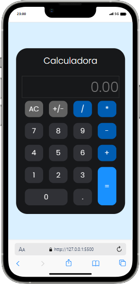

 <h1>Projeto3-Calculadora-DevClub</h1>
<h2>Sobre</h2>

Projeto básico de uma calculadora, usando as tecnologias de <b>HTML | CSS | JavaScript,</b>desenvolvido com professor <a href="https://rodolfomori.com.br/devclub/"><b>Rodolfo Mori</b></a> conforme foto abaixo:

 

